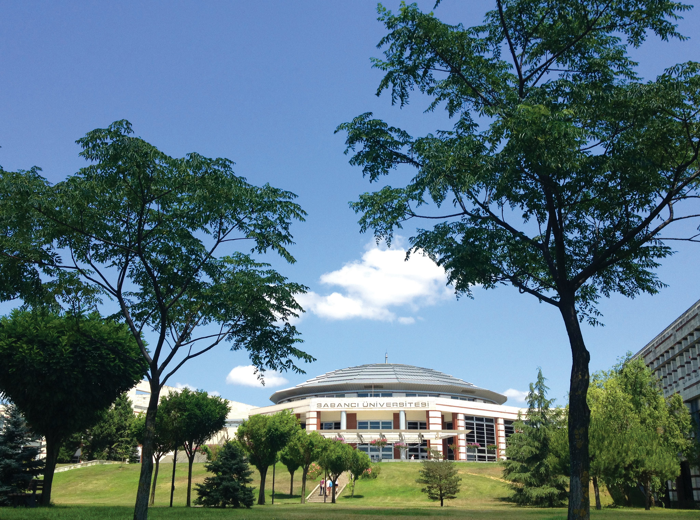
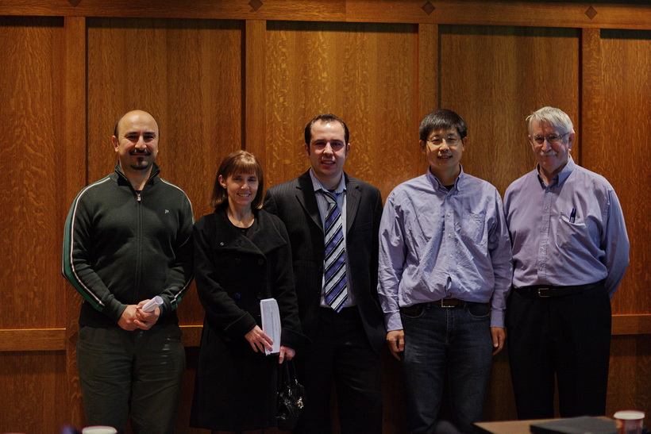
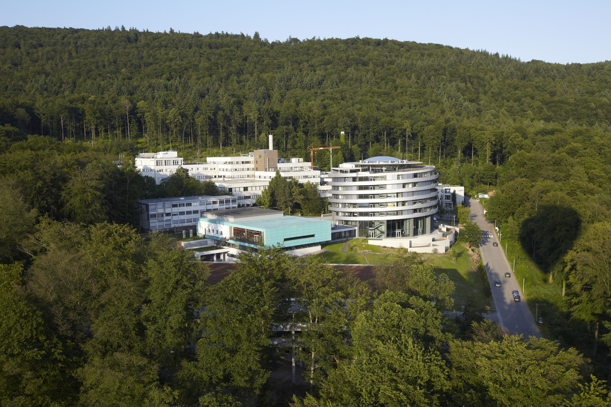
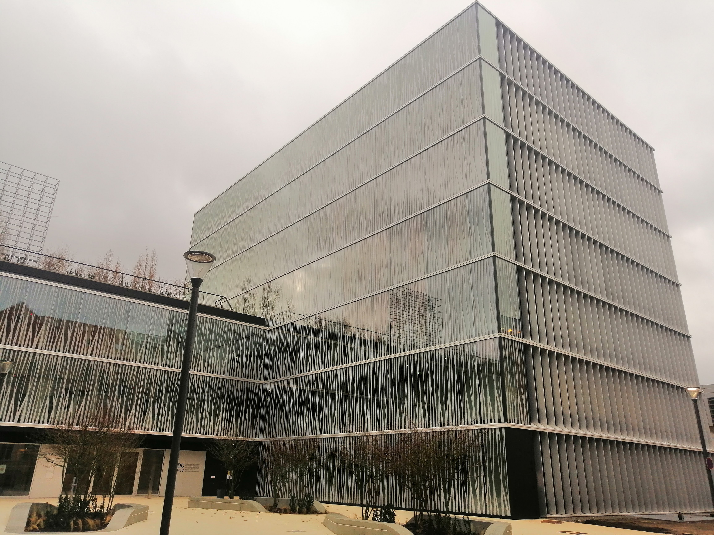

<!-- Main -->

<!-- One -->
<section id="one">
	

		<header class="major">
			<h2>My career journey</h2>
		</header>
		
 Hello! I am Bora. I am a Bioinformatics Scientist at the 
			<a href='https://www.mdc-berlin.de/bimsb' > Berlin Institute of Medical Systems Biology </a>
			of the <a href='https://www.mdc-berlin.de' > Max-Delbruck-Center for Molecular Medicine. </a>
		

	

</section>

<!-- Two -->
<section id="two" class="spotlights">
	<section>
		
		

			

				<header class="major">
					<h3>BSc</h3>
				</header>
				
I decided to study Bioinformatics back in 2004 at Sabanci University (Istanbul,Turkey), where I was inspired by the freshman projects offered by <a href='http://www.sezermanlab.org' > Ugur Sezerman, </a> who is probably responsible for dozens of other people to choose to study bionformatics :). I graduated from Sabanci University in 2008 and moved to Vancouver/Canada to do my Master's degree.
				

			

		

	</section>
	<section>
		
		

			

				<header class="major">
					<h3>MSc</h3>
				</header>
				
I did my Master's degree in Vancouver/Canada, where I finished a 
					<a href='https://bcbioinformaticsgrad.ca' > Bioinformatics Training Program </a> 
					jointly organized by Simon Fraser University and University of British Columbia. 
					There, I had the chance to do rotation projects in the groups of 
					<a href='https://scholar.google.com/citations?user=O8wbTncAAAAJ&hl=en' > Cenk Sahinalp </a>, 
					<a href='https://scholar.google.com/citations?user=Svk1wjsAAAAJ&hl=en' > Inanc Birol </a>, 
					<a href='https://scholar.google.ca/citations?user=XTZ7_NUAAAAJ&hl=en' > Marco Marra </a>, and 
					<a href='https://scholar.google.com/citations?user=tEN1cS0AAAAJ&hl=en' > Nansheng Chen </a>. 
					I wrote my Master's thesis titled "Homology and Evidence-based Genome Annotation of Caenorhabditis Species" in the group of Nansheng Chen and defended my thesis in December 2010.
				

			

		

	</section>
	<section>
		
		

			

				<header class="major">
					<h3>PhD</h3>
				</header>
				
I obtained my PhD from the European Molecular Biology Laboratory, where I worked in 
					<a href='https://scholar.google.de/citations?user=udfEf1EAAAAJ&hl=en' > Toby Gibson's team </a>. I defended my doctoral thesis on "the Roles of Short Linear Motifs in Human Diseases" in the University of Heidelberg in November, 2014 and stayed in Toby's team as a bridging postdoctoral fellow until July, 2015.
				

			

		

	</section>
	<section>
		
		

			

				<header class="major">
					<h3>Postdoc</h3>
				</header>
				
Since August 2015, I have been working in the group of 
					<a href='https://bioinformatics.mdc-berlin.de' > Altuna Akalin </a> 
					at the Bioinformatics and Omics Data Science Platform. 
					If you are curious about my professional background, check out 
					<a href='https://borauyar.com/CV/' > my portfolio page. </a> 
				

			

		

	</section>
</section>
